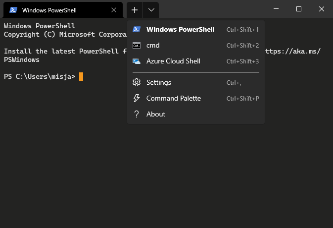
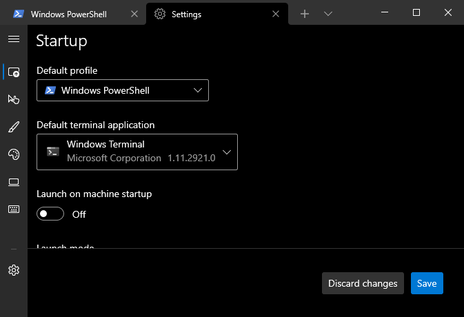
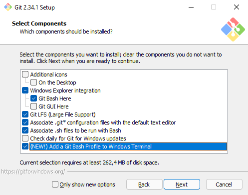
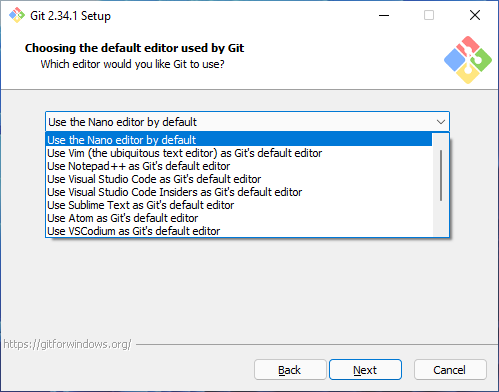
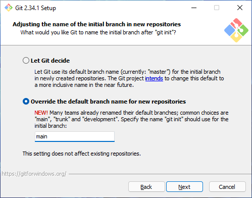
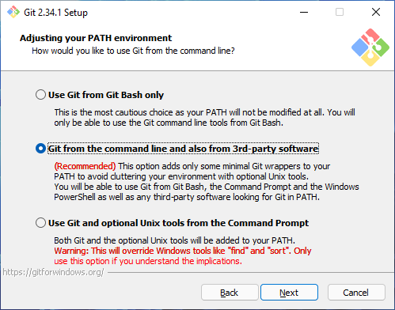
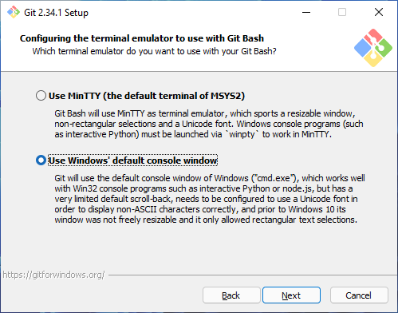
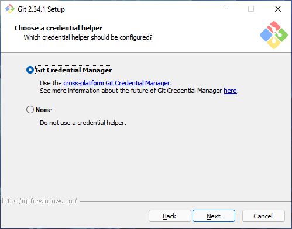

# Versiebeheer met Git


[Git](https://git-scm.com/) is een veelgebruikt hulpmiddel voor het bijhouden van wijzigingen in broncode (of andere verzamelingen van bestanden en mappen). Het bijhouden van deze wijzigingen is niet alleen handig voor jezelf, maar ook als je gaat samenwerken met anderen.

## Installeren

Git is software die je moet installeren. Misschien heb je het al geïnstalleerd, lees dan in ieder geval de installatiestappen door want ze kunnen misschien nog wat tips bevatten!

## Windows

### Windows Terminal

```{important}
Let op, het volgende geldt *alleen* als je Microsoft Windows 11 of hoger gebruikt. Sla deze stap over als dit niet het geval is en ga verder met [](git-install).
```

Deze stap is niet noodzakelijk, maar we raden je aan om eerst een moderne terminal omgeving op te zetten omdat je Git vaak op een command line zal gaan gebruiken. Editors als VScode hebben vaak al een ingebouwde (moderne) terminal, maar jouw systeem misschien nog niet.

Waarom *modern*? De standaard terminal van Windows is oud en dateert uit de vorige eeuw. Microsoft is deze omgeving aan het vernieuwen, onder andere met een nieuwe terminal applicatie (*Windows Terminal*) die je kan installeren via [Microsoft Store](https://www.microsoft.com/en-us/p/windows-terminal/9n0dx20hk701). Je zal straks zien dat je deze terminal als *standaard* kan instellen (wat ook de samenwerking met Git zal vergemakkelijken!).



Start na installatie Windows Terminal, want je zal een paar dingen willen aanpassen via *Settings*!



Kies voor Windows Terminal als *Default Terminal application* en vanaf nu zal de oude (antieke!) terminal omgeving **niet** meer worden gebruikt!

Onderaan dit scherm vind je ook de optie *Launch size* waarmee je de standaard grootte van de terminal kan instellen, wij raden 80 kolommen en 24 rijen aan.

```{note}
De waarde 80 voor het aantal kolommen heeft een historische achtergrond, dit was het aantal kolommen van een [IBM ponskaart](https://en.wikipedia.org/wiki/Punched_card#IBM_80-column_format_and_character_codes). Nog steeds wordt deze breedte vaak aangehouden voor terminals en soms ook in editors (als het punt waar tekst moet gaan omlopen naar een volgende regel).
```

Verken verder welke opties je nog meer kan instellen om Windows Terminal naar jouw smaak aan te passen, bijvoorbeeld met een kleurenthema zoals wij hebben gedaan.

(git-install)=
### Git installeren

Ga naar [https://git-scm.com/download/windows](https://git-scm.com/download/windows) en download Git voor jouw systeem. Tijdens de installatie kan je voor vrijwel alles de standaard opties kiezen, maar bij een paar stappen moet je even opletten!



-   *Git GUI Here* hoef je **niet** te kiezen
-   Ook *Git Bash Here* is **niet** noodzakelijk (maar mag je laten staan)
-   Selecteer **wel** *Add a Git Bash Profile to Windows Terminal*
-   Optioneel kan je kiezen voor *Check daily for Git for Windows updates*



Editors als VSCode hebben Git ondersteuning geïntegreerd en daar zal je het meest mee gaan werken. Een mogelijke andere situatie zal zijn dat je Git direct via de terminal gebruikt en dan is het handig om een editor te hebben die je in de terminal kan gebruiken. We raden hier *Nano* aan, een eenvoudige en makkelijk te gebruiken editor.



Kies hier voor *Override the default branch name for new repositories* en vul de naam "main" in.



De bovenstaande stap is belangrijk, kies er voor om Git op de command line te kunnen gebruiken!



Kies bij deze optie voor *Use Window's default console window*. Je zal lezen dat Git deze optie afraadt, maar deze redenen gelden niet meer omdat je eerder Windows Terminal als standaard console (terminal) hebt ingesteld.



Tot slot, kies voor *Git Credential Manager*, deze optie is van belang voor het onthouden van gebruikersnaam en wachtwoord als je online diensten als [GitHub](https://github.com/) gaat gebruiken.

## macOS

Er zijn verschillende manieren om Git op een Mac te installeren. De meest eenvoudige is waarschijnlijk om de [Xcode Command Line Tools](https://developer.apple.com/download/all/?q=command%20line%20tools) te installeren, op Mavericks (10.9) of hoger kun je dit eenvoudig doen door Git vanuit de Terminal app aan te roepen met bijvoorbeeld

```console
$ git config --list
```

Als je Git nog niet hebt geïnstalleerd zal het je vragen om het te installeren met de XCode Command Line Tools.

Als je een meer up-to-date versie wilt kan je Git ook direct downloaden en installeren via [https://git-scm.com/download/mac](https://git-scm.com/download/mac).

## Linux

Git zal waarschijnlijk al op jouw systeem aanwezig zijn, controleer dit door Git het aan te roepen in een terminal

```console
$ git --version
```

Gebruik jouw package manager (apt, rpm) om Git te installeren als het ontbreekt, bijvoorbeeld

```console
$ sudo apt-get install git
```

## Configuratie

Het eerste (en enige) wat je na installatie nog moet doen is het instellen van jouw naam en emailadres. Dit is belangrijk omdat Git bij iedere *commit* (het vaststellen van wijzigingen in jouw code) deze informatie gaat gebruiken. Open een terminal en typ het volgende

```console
$ git config --global user.name "Jouw Naam"
$ git config --global user.email jouw@naam.com
```

Gebruik hier natuurlijk jouw werkelijke *naam* en *emailadres*! Je kan deze regels meerdere keren uitvoeren, bijvoorbeeld om het emailadres te wijzigen. Controleer vervolgens of de instellingen corrrect zijn

```console
$ git config --list
user.name=Jouw Naam
user.email=jouw@naam.com
init.defaultbranch=main
color.status=auto
color.branch=auto
color.interactive=auto
color.diff=auto
...
```

Let op, jouw uitvoer kan verschillen maar je zal in ieder geval de opties `user.name` en `user.email` terugzien die je eerder hebt gezet. Je kan ook controleren wat Git denkt dat de waarde van een specifieke optie is door `git config <optie>` te typen

```console
$ git config user.name
```

### macOS en Linux

Controleer of de optie `init.defaultbranch` is gezet en gelijk is aan "main". Wijzig het als volgt als dit niet het geval is

```console
$ git config --global init.defaultbranch main
```

```{note}
Diensten als [GitHub](https://github.com) en [GitLab](https://gitlab.com) gebruiken inmiddels standaard "main" voor de hoofdbranch (in plaats van het oorspronkelijke "master"). Git zal deze naam ook op termijn gaan gebruiken en we lopen met deze optie alvast vooruit op ontwikkelingen.
```

## Grafische omgeving

Git is een command line applicatie, omgevingen als VSCode weten van Git en hebben daar vaak een eenvoudige grafische interface voor. Het is waarschijnlijk dat jouw installatie (Windows of Linux) naast `git` (of `git.exe` voor Windows) ook `gitk` bevat, een eenvoudige grafische interface voor Git. macOS gebruikers zullen een ander alternatief moeten gebruiken.

Een populaire grafische omgeving voor Git is [GitHub Desktop](https://desktop.github.com/) voor macOS en Windows, Linux gebruikers kunnen versies voor verschillende distributies vinden op [https://github.com/shiftkey/desktop/](https://github.com/shiftkey/desktop/releases). Andere gafische interfaces kan je op Git [GUI Clients](https://git-scm.com/downloads/guis/) vinden.

```{important}
We raden je aan eerst goed te begrijpen hoe Git werkt en dit eerst met de command line te oefenen, pas dan zal je ook de grafische interfaces beter begrijpen en ze efficiënt kunnen gaan gebruiken!
```

Git is nu klaar voor gebruik!
